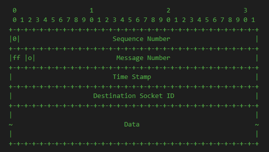
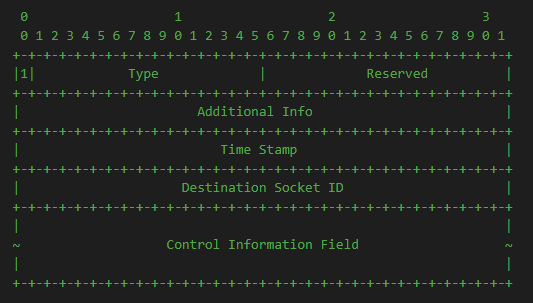

## UDT特性

### 探测包

### 拥塞控制

### 滑动窗口

### 四次握手


如图，udt进行了四次握手。过程如下：

第一次握手：客户端向服务端发送握手请求。同时将序列号、滑动窗口、最大报文段同步给服务端。

第二次握手：服务端计算cookie，返回给客户端。此时服务端并不保存连接状态，可以防止Dos攻击。

第三次握手：客户端拿到cookie再次请求连接。

第四次握手：服务器创建socket等资源，将服务端socket、最大报文段通知给客户端。连接建立成功。

这里之所以选择四次连接，是为了交换cookie，防止Dos攻击。

接下来分析一下如果每次握手的数据包丢失该怎么处理：

第一次数据包丢失：客户端开启定时器，250毫秒内收不多服务端发送来的握手消息，认为数据包丢失，客户端尝试再次发送。

第二次数据包丢失：握手丢失后，服务端不做处理，因为客户端会超时重发。

第三次数据包丢失：这时候已经拿到服务端的cookie了，将cookie放在握手消息中，请求第三次握手，也是通过定时器处理的。和第一次握手处理方式一样。

第四次数据包丢失：这时服务端已经创建连接，通知客户端建立连接。如果丢失，不做处理，客户端发现始终接收不到服务端的消息，会重新发送第三次握手。

### 四次挥手

### 确认应答


## 线程职能

### 主线程

#### 三次握手

#### 四次挥手

#### 拥塞控制

### 垃圾回收线程

当udt启动时，创建一个垃圾回收线程。线程的职责是不断检查socket状态，发现关闭的socket，将其回收处理。

启动流程：

```c++
int CUDTUnited::startup() {
    CGuard gcinit(m_InitLock);
    if (m_iInstanceCount++ > 0) return 0;     // 单例模式，多次创建实例增加引用计数
    
    if (m_bGCStatus) return true;
    m_bClosing = false;
    pthread_mutex_init(&m_GCStopLock, NULL);
    pthread_cond_init(&m_GCStopCond, NULL);
    pthread_create(&m_GCThread, NULL, garbageCollect, this);
    m_bGCStatus = true;
    return 0;
}
```

从代码中可以看出，**CUDTUnited**是一个共享实例，多次创建时增加引用。最后一个实例释放时，才会真正的关闭**CUDTUnited**，代码如下：

```c++
int CUDTUnited::cleanup() {
    CGuard gcinit(m_InitLock);

    if (--m_iInstanceCount > 0)
        return 0;
    if (!m_bGCStatus) return 0;
    m_bClosing = true;				// 关闭CUDTUnited
    pthread_cond_signal(&m_GCStopCond);
    pthread_join(m_GCThread, NULL);		// 等待回收 “垃圾回收” 线程
    pthread_mutex_destroy(&m_GCStopLock);
    pthread_cond_destroy(&m_GCStopCond);
    m_bGCStatus = false;
    return 0;
}
```

垃圾回收创建后，一直在跑`while`循环，直到关闭**CUDTUnited**之后才跑`while`之后的逻辑。我们先来看看**CUDTUnited**一直处于open状态下的逻辑，即`while`循环之内的逻辑。

```c++
void* CUDTUnited::garbageCollect(void* p) {
    CUDTUnited* self = (CUDTUnited*)p;
    CGuard gcguard(self->m_GCStopLock);

    // 初始化为false，当调用cleanup，将m_bClosing设置为true，停止检查
    while (!self->m_bClosing) {
        //当UDT协议判断某一个UDT SOCKET的状态不正确时，会将其状态设置为BROKEN，并在这个函数中进行处理
        self->checkBrokenSockets();

        #ifndef WIN32
        timeval now;
        timespec timeout;
        gettimeofday(&now, 0);
        timeout.tv_sec = now.tv_sec + 1;
        timeout.tv_nsec = now.tv_usec * 1000;

        pthread_cond_timedwait(&self->m_GCStopCond, &self->m_GCStopLock, &timeout);   // 睡1s
        #else
        WaitForSingleObject(self->m_GCStopCond, 1000);
        #endif
    }
    // ......
}
```

`while`循环中不断调用`checkBrokenSockets`函数。我们介绍一下它。


### 发送线程

### 接收线程

## 数据结构

### 数据包

bit 0:
	0: 数据包
	1: 控制包
bit  Sequence Number:  包的序列号
bit ff:
	11: 单个消息包
	10: 一个消息的第一个包
	01: 一个消息的最后一个包
bit o:
	0: 不必须交付
	1: 必须交付
bit Message Number: 消息的序列号
bit Time Stamp: udt socket 打开至今的时间，是一个差值。当前时间 - udt socket 打开的时间。
bit Destination Socket ID: 端口复用时，用来区分那个udt连接。



### 控制包



#### Protocol Connection Handshake

握手协议其实在控制包里没有被用到的。这里也简单介绍一下它的数据结构。

```c++
Additional Info:Undefined
Control Information:
	m_iVersion: UDT version
    m_iType: UDT socket type
    m_iISN: random initial sequence number
    m_iMSS: maximum segment size
    m_iFlightFlagSize: flow control window size
    m_iReqType: connection request type: 1: regular connection request, 0: rendezvous connection request, -1/-2: response
    m_iID: udt socket ID
    m_iCookie: cookie 验证握手消息
    m_piPeerIP: The IP address that the peer's UDP port is bound to
```

从代码中可以看出，`processCtrl`函数是在已经连接成功的情况下调用。所以不会进行握手消息的处理。

```c++
void* CRcvQueue::worker(void* param)
{
    // ......
    else if (id > 0)
    {
      if (NULL != (u = self->m_pHash->lookup(id)))    // 旧连接
      {
		// ......
        u->processCtrl(unit->m_Packet);     // 控制包
        // ......
      }
      // ......
    }
}
```

#### Keep-alive

心跳控制包。在超时检查`checkTimers`中调用，目的是为了在没有数据往来的情况下，使socket保持连接。

心跳包没有参数，直接调用`sendCtrl(1)`发送。

#### Acknowledgement

确认应答控制包。在超时检查`checkTimers`中，到达了ACK应答的时间，会走ACK应答处理`sendCtrl(2)`。此外还有一种轻量级ACK应答`sendCtrl(2, NULL, NULL, 4)`，它是在一个ACK周期中接收多个数据包时，提高ACK的及时性而出现的。有效释放缓冲区的压力，提高数据传输效率。

这里先说一下轻量级ACK数据结构：

```c++
m_iSeqNo = 0x80020000
m_iMsgNo = 0;
m_iTimeStamp = 0;
m_iID = m_PeerID
m_pcData = ackSeq
```

当在一个ACK周期中接到多个数据包时，为了提高传输效率，接收方会向发送方发送一个轻量级ACK。发送端接收到轻量级ACK后更新滑动窗口和确认ACK序列号，代表接收方已经接收到数据，但是还没有进行ACK处理。具体逻辑我们看一下代码：

```c++
// 发送轻量级ACK  sendCtrl(2, NULL, NULL, 4);
void CUDT::sendCtrl(int pkttype, void* lparam, void* rparam, int size)
{
    CPacket ctrlpkt;
    switch (pkttype)
    {
	case 2: //010 - Acknowledgement
        {
        int32_t ack;

        // If there is no loss, the ACK is the current largest sequence number plus 1;
        // Otherwise it is the smallest sequence number in the receiver loss list.
        if (0 == m_pRcvLossList->getLossLength())
          	ack = CSeqNo::incseq(m_iRcvCurrSeqNo);    // ack = m_iRcvCurrSeqNo+1
        else
          	ack = m_pRcvLossList->getFirstLostSeq();    //  ack = firstLostSeq, firstLostSeq之前的序列已经全部接收。

        if (ack == m_iRcvLastAckAck)
        	break;

        // send out a lite ACK
        // to save time on buffer processing and bandwidth/AS measurement, a lite ACK only feeds back an ACK number
        if (4 == size)
        {
        	ctrlpkt.pack(pkttype, NULL, &ack, size);
         	ctrlpkt.m_iID = m_PeerID;
            m_pSndQueue->sendto(m_pPeerAddr, ctrlpkt);
	        break;
        }
        // ......
    }
    // ......
}
// 接收轻量级ACK 
void CUDT::processCtrl(CPacket& ctrlpkt)
{
    switch (ctrlpkt.getType())
    {
    case 2: //010 - Acknowledgement
        int32_t ack;
        // process a lite ACK
        if (4 == ctrlpkt.getLength())
        {
            ack = *(int32_t *)ctrlpkt.m_pcData;
            if (CSeqNo::seqcmp(ack, m_iSndLastAck) >= 0)
            {
                // 更新滑动窗口和ACK确认。
                m_iFlowWindowSize -= CSeqNo::seqoff(m_iSndLastAck, ack);
                m_iSndLastAck = ack;
            }
            break;
        }
        // ......
    }
    // ......
}
```

然后介绍一下正常ACK的数据结构：

```c++
m_iSeqNo = 0x80020000
m_iMsgNo = ackSeqNo;
m_iTimeStamp = 0;
m_iID = m_PeerID
m_pcData = {m_iRcvLastAck, m_iRTT, m_iRTTVar, RcvBufferSize, PktRcvSpeed, Bandwidth}
```

```c++
// 发送常规ACK  sendCtrl(2);
void CUDT::sendCtrl(int pkttype, void* lparam, void* rparam, int size)
{
    CPacket ctrlpkt;
    switch (pkttype)
    {
    case 2: //010 - Acknowledgement
        int32_t ack;
		// 1. 获取数据包ack序列号。
        // If there is no loss, the ACK is the current largest sequence number plus 1;
        // Otherwise it is the smallest sequence number in the receiver loss list.
        if (0 == m_pRcvLossList->getLossLength())
            ack = CSeqNo::incseq(m_iRcvCurrSeqNo);    // ack = m_iRcvCurrSeqNo+1
        else
            ack = m_pRcvLossList->getFirstLostSeq();    //  ack = firstLostSeq, firstLostSeq之前的序列已经全部接收。
        // ......
        uint64_t currtime;
        CTimer::rdtsc(currtime);

        // There are new received packets to acknowledge, update related information.
        // 2. 真正的ack数据，从接收缓冲区中ack，被ack后的数据就可以读取了。
        if (CSeqNo::seqcmp(ack, m_iRcvLastAck) > 0)
        {
            int acksize = CSeqNo::seqoff(m_iRcvLastAck, ack);

            m_iRcvLastAck = ack;

            m_pRcvBuffer->ackData(acksize);   // ack数据

            // signal a waiting "recv" call if there is any data available
            #ifndef WIN32
            pthread_mutex_lock(&m_RecvDataLock);
            if (m_bSynRecving)
                pthread_cond_signal(&m_RecvDataCond);
            pthread_mutex_unlock(&m_RecvDataLock);
            #else
            if (m_bSynRecving)
                SetEvent(m_RecvDataCond);
            #endif

            // acknowledge any waiting epolls to read
            s_UDTUnited.m_EPoll.update_events(m_SocketID, m_sPollID, UDT_EPOLL_IN, true);
        }
        else if (ack == m_iRcvLastAck)
        {
            // rto超时重发，丢失数据迟迟没有收到，一个rtt发送一次ACK，通知发送端发送数据。
            if ((currtime - m_ullLastAckTime) < ((m_iRTT + 4 * m_iRTTVar) * m_ullCPUFrequency))
                break;
        }
        else
            break;

        // Send out the ACK only if has not been received by the sender before
        // 3. 组织数据，发送常规ack
        if (CSeqNo::seqcmp(m_iRcvLastAck, m_iRcvLastAckAck) > 0)
        {
            int32_t data[6];

            m_iAckSeqNo = CAckNo::incack(m_iAckSeqNo);    // 用于记录最近发送的ACK控制包的SeqNo。
            data[0] = m_iRcvLastAck;		// 数据包ack序列号
            data[1] = m_iRTT;
            data[2] = m_iRTTVar;
            data[3] = m_pRcvBuffer->getAvailBufSize();
            // a minimum flow window of 2 is used, even if buffer is full, to break potential deadlock
            if (data[3] < 2)
                data[3] = 2;

            if (currtime - m_ullLastAckTime > m_ullSYNInt)
            {
                data[4] = m_pRcvTimeWindow->getPktRcvSpeed();
                data[5] = m_pRcvTimeWindow->getBandwidth();
                ctrlpkt.pack(pkttype, &m_iAckSeqNo, data, 24);

                CTimer::rdtsc(m_ullLastAckTime);
            }
            else
            {
                ctrlpkt.pack(pkttype, &m_iAckSeqNo, data, 16);
            }

            ctrlpkt.m_iID = m_PeerID;
            m_pSndQueue->sendto(m_pPeerAddr, ctrlpkt);
			// 将控制包ack序列号存在m_pACKWindow中，二次确认时计算RTT
            m_pACKWindow->store(m_iAckSeqNo, m_iRcvLastAck);
            ++ m_iSentACK;
            ++ m_iSentACKTotal;
        }
}
```

发送确认ACK主要有3个步骤：

1. 获取数据包ack序列号。ack之前的所有数据包均已被ack过了。
   1. 如果没有丢失数据包，即是m_iRcvCurrSeqNo+1。
   2. 否则ack为第一个丢失的序列号。
2. ACK数据。
   1. 如果还没有被ack过，从接收缓冲区中ack，被ack后的数据就可以读取了。
   2. 如果已经ack过了，超时重复ack。
3. 组织数据，发送常规ack。
   1. 填充data，发送数据。
   2. 将控制包ack序列号存在m_pACKWindow中，二次确实时计算RTT。

```c++
void CUDT::processCtrl(CPacket& ctrlpkt)
{
    //switch (ctrlpkt.getType())
    {
    case 2: //010 - Acknowledgement
        // ......
        //1. 读取ACK序列号，到达发送周期，发送二次确认
        // ......
        // 2. 获取数据包ACK序列号，检查序列号的合法性，更新滑动窗口和m_iSndLastAck
        ack = *(int32_t *)ctrlpkt.m_pcData;     // 数据包的ACK

        // check the validation of the ack    收到了从未发送的数据包ACK
        if (CSeqNo::seqcmp(ack, CSeqNo::incseq(m_iSndCurrSeqNo)) > 0)
        {
            //this should not happen: attack or bug
            m_bBroken = true;
            m_iBrokenCounter = 0;
            break;
        }

        if (CSeqNo::seqcmp(ack, m_iSndLastAck) >= 0)    // 确定是发送出去的数据包ack
        {
            // Update Flow Window Size, must update before and together with m_iSndLastAck
            m_iFlowWindowSize = *((int32_t *)ctrlpkt.m_pcData + 3);
            m_iSndLastAck = ack;
        }

        // protect packet retransmission
        CGuard::enterCS(m_AckLock);

        // 3. 检查发送数据ACK，如果是已经ack过的数据，直接退出，不需要重复处理ack。
        int offset = CSeqNo::seqoff(m_iSndLastDataAck, ack);
        if (offset <= 0)
        {
            // discard it if it is a repeated ACK
            CGuard::leaveCS(m_AckLock);
            break;
        }

        // 3.2 发送缓冲区ack数据，更新发送丢失链表
        // acknowledge the sending buffer
        m_pSndBuffer->ackData(offset);    // 移除发送缓冲区中已经ack的数据

        // record total time used for sending
        m_llSndDuration += currtime - m_llSndDurationCounter;
        m_llSndDurationTotal += currtime - m_llSndDurationCounter;
        m_llSndDurationCounter = currtime;

        // update sending variables
        m_iSndLastDataAck = ack;
        m_pSndLossList->remove(CSeqNo::decseq(m_iSndLastDataAck));    // 小于等于ack的包已经被接收，删除losslist中的数据

        CGuard::leaveCS(m_AckLock);

        #ifndef WIN32
        pthread_mutex_lock(&m_SendBlockLock);
        if (m_bSynSending)
            pthread_cond_signal(&m_SendBlockCond);    // 发送条件信号，可以继续调用send发送数据到缓冲区中
        pthread_mutex_unlock(&m_SendBlockLock);
        #else
        if (m_bSynSending)
            SetEvent(m_SendBlockCond);
        #endif

        // acknowledde any waiting epolls to write
        s_UDTUnited.m_EPoll.update_events(m_SocketID, m_sPollID, UDT_EPOLL_OUT, true);

        // insert this socket to snd list if it is not on the list yet
        m_pSndQueue->m_pSndUList->update(this, false);

        // Update RTT
        //m_iRTT = *((int32_t *)ctrlpkt.m_pcData + 1);
        //m_iRTTVar = *((int32_t *)ctrlpkt.m_pcData + 2);
        // 4. 计算RTT，更新发送速率、带宽，更新拥塞控制。
        int rtt = *((int32_t *)ctrlpkt.m_pcData + 1);
        m_iRTTVar = (m_iRTTVar * 3 + abs(rtt - m_iRTT)) >> 2;
        m_iRTT = (m_iRTT * 7 + rtt) >> 3;

        m_pCC->setRTT(m_iRTT);

        if (ctrlpkt.getLength() > 16)
        {
            // Update Estimated Bandwidth and packet delivery rate
            if (*((int32_t *)ctrlpkt.m_pcData + 4) > 0)
                m_iDeliveryRate = (m_iDeliveryRate * 7 + *((int32_t *)ctrlpkt.m_pcData + 4)) >> 3;

            if (*((int32_t *)ctrlpkt.m_pcData + 5) > 0)
                m_iBandwidth = (m_iBandwidth * 7 + *((int32_t *)ctrlpkt.m_pcData + 5)) >> 3;

            m_pCC->setRcvRate(m_iDeliveryRate);
            m_pCC->setBandwidth(m_iBandwidth);
        }

        m_pCC->onACK(ack);
        CCUpdate();

        ++ m_iRecvACK;
        ++ m_iRecvACKTotal;
    }
}
```

接收确认ACK主要有4个步骤：

1. 读取ACK序列号，到达发送周期，发送二次确认。
2. 获取数据包ACK序列号。
   1. 检查序列号的合法性，接收非发送的数据的ack序列号，认为受到攻击或者bug，关闭socket。
   2. 更新滑动窗口和m_iSndLastAck。
3. 处理确认ACK序列号。
   1. 检查发送数据ACK，如果是已经ack过的数据，直接退出，不需要重复处理ack。
   2. 发送队列ack数据，从发送丢失队列中移除ack之前的数据。
4. 计算RTT，更新发送速率、带宽，更新拥塞控制。

#### Negative Acknowledgement

当`processData`函数发现有数据包丢失时，会向发送端发送NAK控制包。

```c++
int CUDT::processData(CUnit* unit)
{
    // ......
    if (CSeqNo::seqcmp(packet.m_iSeqNo, CSeqNo::incseq(m_iRcvCurrSeqNo)) > 0)
    {
        // ......
        sendCtrl(3, NULL, lossdata, (CSeqNo::incseq(m_iRcvCurrSeqNo) == CSeqNo::decseq(packet.m_iSeqNo)) ? 1 : 2);
        // ......
    }
    // ......
}
```

这里介绍一下控制包的数据结构。

```c++
m_iSeqNo = 0x80030000
m_iMsgNo = 0;
m_iTimeStamp = 0;
m_iID = m_PeerID
m_pcData = {loss_start, loss_end}
```

接着介绍一下发送NAK的流程和接收NAK的流程。

```c++
void CUDT::sendCtrl(int pkttype, void* lparam, void* rparam, int size)
{
    CPacket ctrlpkt;
    //switch (pkttype)
    {
        case 3: //011 - Loss Report
        if (NULL != rparam)
        {
            if (1 == size)		// 丢失1个数据包
            {
                // only 1 loss packet
                ctrlpkt.pack(pkttype, NULL, (int32_t *)rparam + 1, 4);
            }
            else				// 丢失一段数据包
            {
                // more than 1 loss packets
                ctrlpkt.pack(pkttype, NULL, rparam, 8);
            }

            ctrlpkt.m_iID = m_PeerID;
            m_pSndQueue->sendto(m_pPeerAddr, ctrlpkt);

            ++ m_iSentNAK;
            ++ m_iSentNAKTotal;
        }
        // ......
        // update next NAK time, which should wait enough time for the retansmission, but not too long
        // 更新NAK发送周期，其实这里没有必要了，因为取消了NAK定时器。
        m_ullNAKInt = (m_iRTT + 4 * m_iRTTVar) * m_ullCPUFrequency;
        int rcv_speed = m_pRcvTimeWindow->getPktRcvSpeed();
        if (rcv_speed > 0)
            m_ullNAKInt += (m_pRcvLossList->getLossLength() * 1000000ULL / rcv_speed) * m_ullCPUFrequency;
        if (m_ullNAKInt < m_ullMinNakInt)
            m_ullNAKInt = m_ullMinNakInt;
    }
}
```

发送NAK控制包有2个步骤：

1. 打包控制包信息。
2. 用RTT、接收速率更新NAK发送周期。其实这步没有必要了，因为最新版本的udt不会触发NAK定时器，仅仅依靠发送方的重传超时。

```c++
void CUDT::processCtrl(CPacket& ctrlpkt)
{
    switch (ctrlpkt.getType())
    {
    case 3: //011 - Loss Report
        int32_t* losslist = (int32_t *)(ctrlpkt.m_pcData);

        // 1. 更新拥塞控制
        m_pCC->onLoss(losslist, ctrlpkt.getLength() / 4);
        CCUpdate();

        bool secure = true;

        // 2. 处理loss数据对
        // decode loss list message and insert loss into the sender loss list
        for (int i = 0, n = (int)(ctrlpkt.getLength() / 4); i < n; ++ i)
        {
            if (0 != (losslist[i] & 0x80000000))    // 一段数据包
            {
                // 2.1 如果是非法数据对，socket处于不安全的状态
                if ((CSeqNo::seqcmp(losslist[i] & 0x7FFFFFFF, losslist[i + 1]) > 0) || (CSeqNo::seqcmp(losslist[i + 1], m_iSndCurrSeqNo) > 0))
                {
                    // seq_a must not be greater than seq_b; seq_b must not be greater than the most recent sent seq
                    secure = false;
                    break;
                }

                int num = 0;
                if (CSeqNo::seqcmp(losslist[i] & 0x7FFFFFFF, m_iSndLastAck) >= 0)
                    num = m_pSndLossList->insert(losslist[i] & 0x7FFFFFFF, losslist[i + 1]);
                else if (CSeqNo::seqcmp(losslist[i + 1], m_iSndLastAck) >= 0)
                    num = m_pSndLossList->insert(m_iSndLastAck, losslist[i + 1]);

                m_iTraceSndLoss += num;
                m_iSndLossTotal += num;

                ++ i;
            }
            else if (CSeqNo::seqcmp(losslist[i], m_iSndLastAck) >= 0)   // 一个数据包
            {
                if (CSeqNo::seqcmp(losslist[i], m_iSndCurrSeqNo) > 0)
                {
                    //seq_a must not be greater than the most recent sent seq
                    secure = false;
                    break;
                }

                int num = m_pSndLossList->insert(losslist[i], losslist[i]);

                m_iTraceSndLoss += num;
                m_iSndLossTotal += num;
            }
        }
        // 3. 发现收到没有发送过数据的loss对，认为受到攻击或者bug
        if (!secure)
        {
            //this should not happen: attack or bug
            m_bBroken = true;
            m_iBrokenCounter = 0;
            break;
        }

        // 4. 触发发送数据，丢失数据立即发送
        // the lost packet (retransmission) should be sent out immediately
        m_pSndQueue->m_pSndUList->update(this);

        ++ m_iRecvNAK;
        ++ m_iRecvNAKTotal;
    }
}
```

接收NAK控制包后进行以下4步处理：

1. 更新拥塞控制。
2. 处理loss数据对
   1. 检查loss对，如果是非法数据对，socket处于不安全的状态。
   2. 将loss对插入到m_pSndLossList中。
3. 发现收到没有发送过数据的loss对，认为受到攻击或者bug。
4. 触发发送数据，丢失数据立即发送。

#### Congestion/Delay Warning

拥塞警告主要的逻辑是增大发送周期。代码中不再使用，这里不做介绍。

#### Shutdown

当调用`CUDT::close()`函数时，将关闭socket连接，发送**Shutdown**控制包给对方，通知关闭socket连接。

**Shutdown**控制包的数据结构：

```c++
m_iSeqNo = 0x80050000
m_iMsgNo = 0;
m_iTimeStamp = 0;
m_iID = m_PeerID
```

发送端的逻辑很简单，封装数据包，发送出去。

```c++
void CUDT::sendCtrl(int pkttype, void* lparam, void* rparam, int size)
{
  CPacket ctrlpkt;

  switch (pkttype)
  {
  case 5: //101 - Shutdown
      ctrlpkt.pack(pkttype);
      ctrlpkt.m_iID = m_PeerID;
      m_pSndQueue->sendto(m_pPeerAddr, ctrlpkt);
      break;
  }
}
```

接收端的逻辑也很简单，设置关闭状态。

```c++
void CUDT::processCtrl(CPacket& ctrlpkt)
{
    switch (ctrlpkt.getType())
    {
    case 5: //101 - Shutdown
        m_bShutdown = true;
        m_bClosing = true;
        m_bBroken = true;
        m_iBrokenCounter = 60;
        // Signal the sender and recver if they are waiting for data.
        releaseSynch();
        CTimer::triggerEvent();
        break;
    }
}
```

#### Acknowledgement of Acknowledement

当发送端收到常规**Acknowledgement **消息时，需要给接收端发送二次确认消息。目的是为了通知接收端已经收到ACK确认包，供接收端计算RTT使用。

```c++
m_iSeqNo = 0x80060000
m_iMsgNo = ackSeqNo;
m_iTimeStamp = 0;
m_iID = m_PeerID
```

```c++
// 接收端：发送确认ACK时，将确认序列号加入m_pACKWindow中
void CUDT::sendCtrl(int pkttype, void* lparam, void* rparam, int size)
{
    CPacket ctrlpkt;
    switch (pkttype)
    {
    case 2: //010 - Acknowledgement
        // ......
        m_pSndQueue->sendto(m_pPeerAddr, ctrlpkt);
        // 发送确认ACK后将序列号加入m_pACKWindow
        m_pACKWindow->store(m_iAckSeqNo, m_iRcvLastAck);
        // ......
    }
}
// 发送端：发送二次确认 sendCtrl(6, &ack);
void CUDT::sendCtrl(int pkttype, void* lparam, void* rparam, int size)
{
  	CPacket ctrlpkt;
    switch (pkttype)
    {
    case 6: //110 - Acknowledgement of Acknowledgement
        ctrlpkt.pack(pkttype, lparam);
        ctrlpkt.m_iID = m_PeerID;
        m_pSndQueue->sendto(m_pPeerAddr, ctrlpkt);
        break;
    }
    // ......
}
// 接收端：接收二次确认控制包，进行处理，根据m_pACKWindow中保存的数据计算RTT
void CUDT::processCtrl(CPacket& ctrlpkt)
{
    switch (ctrlpkt.getType())
  	{
    case 6: //110 - Acknowledgement of Acknowledgement
        int32_t ack;
        int rtt = -1;

        // update RTT
        rtt = m_pACKWindow->acknowledge(ctrlpkt.getAckSeqNo(), ack);
        if (rtt <= 0)
            break;

        // RTT EWMA
        m_iRTTVar = (m_iRTTVar * 3 + abs(rtt - m_iRTT)) >> 2;
        m_iRTT = (m_iRTT * 7 + rtt) >> 3;

        m_pCC->setRTT(m_iRTT);

        // update last ACK that has been received by the sender
        if (CSeqNo::seqcmp(ack, m_iRcvLastAckAck) > 0)
            m_iRcvLastAckAck = ack;
        break;
    }
}
```

整体流程是：接收端发送确认ACK->发送端接收确认ACK->发送端发送二次确认->接收端接收二次确认。经过一个RTT。

#### Message Drop Request

半可靠数据传输过程中会发送这个控制包。这里不进行介绍。

#### Error Signal from the Peer Side

没有使用到，不做介绍。

### 公共数据结构

#### CTimer

**CTimer**有两个作用：1. 作为多路复用、发送队列、接收队列实例的成员变量，控制着消息发送的timer。2. 作为静态类，实现了部分静态函数。

##### 作为实例

多路复用器创系统socket之后，紧跟着创建**Timer**实例作为多路复用器的成员变量。

```c++
void CUDTUnited::updateMux(CUDTSocket* s, const sockaddr* addr, const UDPSOCKET* udpsock)
{
    // ......
    CMultiplexer m;     // 创建多路复用器实例
    // ......
    m.m_pTimer = new CTimer;  // 创建Timer实例作为多路复用器的实例m_pTimer
    // ......
}
```

**Timer**作为实例时，有两个函数需要介绍一下，**sleepto**函数和**interrupt**函数。

```c++
void CTimer::sleepto(uint64_t nexttime)      // 成员函数
{
   // Use class member such that the method can be interrupted by others
   m_ullSchedTime = nexttime;             // 睡眠到m_ullSchedTime时间

   uint64_t t;
   rdtsc(t);               // 读取当前时间

   while (t < m_ullSchedTime)             // 轮询直到m_ullSchedTime时退出
   {
      #ifndef NO_BUSY_WAITING
         #ifdef IA32
            __asm__ volatile ("pause; rep; nop; nop; nop; nop; nop;");
         #elif IA64
            __asm__ volatile ("nop 0; nop 0; nop 0; nop 0; nop 0;");
         #elif AMD64
            __asm__ volatile ("nop; nop; nop; nop; nop;");
         #endif
      #else
         #ifndef WIN32
            timeval now;
            timespec timeout;
            gettimeofday(&now, 0);
            // 每次轮询sleep 10ms
            if (now.tv_usec < 990000)
            {
               timeout.tv_sec = now.tv_sec;
               timeout.tv_nsec = (now.tv_usec + 10000) * 1000;
            }
            else
            {
               timeout.tv_sec = now.tv_sec + 1;
               timeout.tv_nsec = (now.tv_usec + 10000 - 1000000) * 1000;
            }
            pthread_mutex_lock(&m_TickLock);
            pthread_cond_timedwait(&m_TickCond, &m_TickLock, &timeout);	// 等待single或超时
            pthread_mutex_unlock(&m_TickLock);
         #else
            WaitForSingleObject(m_TickCond, 1);
         #endif
      #endif

      rdtsc(t);         // 读取时间戳
   }
}
```

这么写虽然实现了可中断的sleep函数，但是每次sleep 10ms，会不会有最大10ms的误差？

```c++
void CTimer::interrupt()
{
   // schedule the sleepto time to the current CCs, so that it will stop
   rdtsc(m_ullSchedTime);        // 将m_ullSchedTime设置为当前时间，触发tick，结束sleepto
   tick();
}

void CTimer::tick()
{
   #ifndef WIN32
      pthread_cond_signal(&m_TickCond);      // 发送signal，唤醒pthread_cond_timedwait函数
   #else
      SetEvent(m_TickCond);
   #endif
}
```

翻阅代码，发现sleepto在发送队列中的worker函数被调用，具体内容将在**CSndQueue::worker**中介绍.

interrupt在向**CSndUList**实例中插入、更新、删除数据时有条件被调用。具体内容将在**CSndUList**类中介绍。

##### 作为静态类

**CTimer**作为静态类，它的事件是供Epoll使用的。当Select时会阻塞。当改变Epoll状态时，会唤醒阻塞的事件。例如新连接、关闭连接、ack数据、超时重发等状态。

#### CACKWindow

发送ACK确认包时，加入到**CACKWindow**中，收到二次确认包时计算差值。**用于计算RTT**。它的数据结构是一个大小为1024的有限数组，新元素覆盖旧元素。查找时是遍历，会不会有点慢？!它有两个主要的函数`store`和`acknowledge`。

#### CPktTimeWindow

用来统计发送速率和带宽(`CUDT::processData`函数中)，更新拥塞控制状态(`CUDT::sendCtrl`函数中)。它的数据结构是数组，当数据包和探测包到达时向数组中插入元素。当发送确认ACK控制包时，将接收状态发送给对方，更新对端的拥塞状态。

### 发送方数据结构

#### CSndUList

**CSndUList**是一个根据**下一个数据包发送时间戳**排序的小顶堆结构，用来保存处于可发送状态的udt socket实例的**m_pSNode**成员变量。

**CSndUList**的小顶堆的结构：

```c++
class CSndUList
{
    // ......
private:
    CSNode** m_pHeap;			// 小顶堆数组，元素为CSNode*类型
    int m_iArrayLength;			// 小顶堆数组的大小
    int m_iLastEntry;			// 小顶堆中元素的个数
    pthread_mutex_t m_ListLock;	// 小顶堆数组的锁
    
    pthread_mutex_t* m_pWindowLock;
    pthread_cond_t* m_pWindowCond;		// 条件变量，与发送线程通信，通知发送线程已有数据到达，可以尝试发送。
}
```

**CSNode**结构如下:

```c++
struct CSNode
{
  CUDT* m_pUDT;   // udt socket 实例的指针
  uint64_t m_llTimeStamp;      // 下一个待发送的消息包的时间戳

  int m_iHeapLoc;   // 在CSndUList的堆中的位置，-1代表不在堆里
};
```

这里介绍放入数据**update**、取出数据**pop**和删除数据**remove**三个函数。关于堆的原理与实现请出门左转至Google。

```c++
/// @brief 将udt socket实例加入堆中，在reschedule为真时，调整元素到堆顶
/// @param u udt socket 实例指针
/// @param reschedule 重新调度，如果已经在堆中，调整到堆顶
void CSndUList::update(const CUDT* u, bool reschedule)
{
  CGuard listguard(m_ListLock);

  CSNode* n = u->m_pSNode;

  if (n->m_iHeapLoc >= 0)   // 已经在调度堆中
  {
    if (!reschedule)        // 不需要重新调度
      return;

    if (n->m_iHeapLoc == 0)   // 已经在堆顶
    {
      n->m_llTimeStamp = 1;   // 代表立即发送数据
      m_pTimer->interrupt();    // 中断timer的sleepto函数，唤醒发送线程，立即发送数据
      return;
    }

    remove_(u);           // 删除堆中元素
  }

  insert_(1, u);      // 插入堆顶
}
```

m_llTimeStamp设置为1，那么相比于很早很早之前的一个时间戳，代表已经过期的时间，那么调用**interrupt**函数后，代码会怎么处理呢？

1. 在**CTimer**类中有介绍，调用**interrupt**后设置**m_ullSchedTime**，然后调用**tick**，发送**m_TickCond** signal给可能处于阻塞的线程，唤醒阻塞的发送线程。
2. 假如发送线程**CSndQueue::worker**处于阻塞状态，经过**interrupt**函数被唤醒，结束**sleepto**函数，接着尝试发送数据。发送数据之前先取出数据。

调用**pop**函数取出数据。

```c++
/// @brief 从堆中取出堆顶的数据，放入pkt参数中
/// @param addr 取出的数据要发送的地址
/// @param pkt 取出的数据
/// @return 取出状态  -1代表不成功，1代表成功
int CSndUList::pop(sockaddr*& addr, CPacket& pkt)
{
  CGuard listguard(m_ListLock);

  if (-1 == m_iLastEntry)       // 堆中没有要发送数据的udt socket实例
    return -1;

  // no pop until the next schedulled time
  uint64_t ts;
  CTimer::rdtsc(ts);
  if (ts < m_pHeap[0]->m_llTimeStamp)     // 当前时间 比 堆中最早的时间 还要早，说明还没有到发送数据的时间
    return -1;

  CUDT* u = m_pHeap[0]->m_pUDT;     // 取出堆中拥有最早的时间戳的udt socket实例
  remove_(u);   // 从堆中移除元素

  if (!u->m_bConnected || u->m_bBroken)   // udt socket状态检查
    return -1;

  // pack a packet from the socket
  if (u->packData(pkt, ts) <= 0)      // 从udt socket 的CSndBuffer缓冲区中取数据
    return -1;

  addr = u->m_pPeerAddr;        // 设置对端地址

  // insert a new entry, ts is the next processing time
  if (ts > 0)
    insert_(ts, u);       // 向堆中插入udt socket实例，下一次发送数据的时间是ts

  return 1;             // 成功取出数据标志
}
```

此处调用**remove_**函数需要进行简单的介绍，因为我怀疑是一个bug。

```c++
void CSndUList::remove_(const CUDT* u)
{
	// ...... 堆数据结构的处理
    // the only event has been deleted, wake up immediately
    if (0 == m_iLastEntry)
    	m_pTimer->interrupt();
}
```

这里触发**interrupt**函数，目的是当udt close时，堆中的数据被清空，立刻中断发送线程调用的**sleepto**函数，唤醒发送线程并退出。这里的判断条件`0 == m_iLastEntry`，而在**CSndUList**实例初始化时，将`m_iLastEntry`初始化为`-1`了，所以当`m_iLastEntry`为0时，堆中应该还有一个udt socket实例，不应该调用**interrupt**函数，应该在`m_iLastEntry`为`-1`时调用。

当udt close时，**remove**函数被调用。

```c++
void CUDT::close() {
	// ......
    if (m_bConnected) m_pSndQueue->m_pSndUList->remove(this);  // 从堆中移除this
    // ......
}
/// @brief 从堆中删除u
/// @param u 被删除的udt socket实例
void CSndUList::remove(const CUDT* u)
{
  CGuard listguard(m_ListLock);
  remove_(u);     // 在堆中删除udt socket实例
}
```

#### CSndQueue

多路复用创建系统socket后，紧跟着创建发送队列**CSndQueue**和接收队列**CRcvQueue**，并初始化。

```c++
void CUDTUnited::updateMux(CUDTSocket* s, const sockaddr* addr, const UDPSOCKET* udpsock)
{
    // ......
    CMultiplexer m;     // 创建多路复用器实例
    // ......
    m.m_pSndQueue = new CSndQueue;      // 创建多路复用使用的发送队列
    m.m_pSndQueue->init(m.m_pChannel, m.m_pTimer);      // 初始化发送队列
  	m.m_pRcvQueue = new CRcvQueue;      // 创建多路复用使用的接收队列
  	// 初始化接收队列
  	m.m_pRcvQueue->init(32, s->m_pUDT->m_iPayloadSize, m.m_iIPversion, 1024, m.m_pChannel, m.m_pTimer);
    // ......
}
```

同一个系统socket端口被多路复用时接收队列**CRcvQueue**和发送队列**CSndQueue**也被复用。换句话说就是一个系统socket对应一个发送队列实例`m.m_pSndQueue`和接收队列实例`m.m_pRcvQueue`。当然**CTimer**实例也是一样。

这里介绍发送队列。发送队列初始化，初始化端口通道`m_pChannel`、计时`m_pTimer`、发送`m_pSndUList`，并创建发送线程。

```c++
void CSndQueue::init(CChannel* c, CTimer* t)
{
  m_pChannel = c;       // 系统socket创建的端口实例，设置UDP属性、发送、接收数据等等
  m_pTimer = t;         // timer，在m_pSndUList中调用interrupt函数，立刻发送数据包出去
  m_pSndUList = new CSndUList;      // 
  m_pSndUList->m_pWindowLock = &m_WindowLock;
  m_pSndUList->m_pWindowCond = &m_WindowCond;
  m_pSndUList->m_pTimer = m_pTimer;

  #ifndef WIN32
    if (0 != pthread_create(&m_WorkerThread, NULL, CSndQueue::worker, this))      // 创建发送消息的线程
    {
      m_WorkerThread = 0;
      throw CUDTException(3, 1);
    }
  #else
    DWORD threadID;
    m_WorkerThread = CreateThread(NULL, 0, CSndQueue::worker, this, 0, &threadID);
    if (NULL == m_WorkerThread)
      throw CUDTException(3, 1);
  #endif
}
```

发送线程主要负责发送用户数据，不断轮询，尝试从m_pSndUList取出数据并发送。

```c++
#ifndef WIN32
  void* CSndQueue::worker(void* param)
#else
  DWORD WINAPI CSndQueue::worker(LPVOID param)
#endif
{
  CSndQueue* self = (CSndQueue*)param;

  while (!self->m_bClosing)       // udt socket没有关闭
  {
    uint64_t ts = self->m_pSndUList->getNextProcTime();   //获取下一次数据包的发送时间

    if (ts > 0)   // 有数据等待被发送
    {
      // wait until next processing time of the first socket on the list
      uint64_t currtime;
      CTimer::rdtsc(currtime);
      if (currtime < ts)      // 还没有到发送时间，sleepto到发送时间
        self->m_pTimer->sleepto(ts);

      // it is time to send the next pkt
      sockaddr* addr;
      CPacket pkt;
      if (self->m_pSndUList->pop(addr, pkt) < 0)    // 取出数据，放到pkt中
        continue;

      self->m_pChannel->sendto(addr, pkt);    // 发送数据
    }
    else      // 没有需要被发送的数据
    {
      // wait here if there is no sockets with data to be sent
      #ifndef WIN32
        pthread_mutex_lock(&self->m_WindowLock);
        if (!self->m_bClosing && (self->m_pSndUList->m_iLastEntry < 0))     // 没有需要发送数据的udt socket实例，进入阻塞状态
          pthread_cond_wait(&self->m_WindowCond, &self->m_WindowLock);
        pthread_mutex_unlock(&self->m_WindowLock);
      #else
        WaitForSingleObject(self->m_WindowCond, INFINITE);
      #endif
    }
  }

  #ifndef WIN32
    return NULL;
  #else
    SetEvent(self->m_ExitCond);
    return 0;
  #endif
}
```

介绍完初始化函数和发送线程，这里介绍一下**sendto**函数，先看代码。

```c++
/// @brief 发送数据packet到addr地址
/// @param addr 发送的地址
/// @param packet 发送的数据
/// @return 发送出去的长度
int CSndQueue::sendto(const sockaddr* addr, CPacket& packet)
{
  // send out the packet immediately (high priority), this is a control packet
  m_pChannel->sendto(addr, packet);     // 调用系统socket端口通道发送数据
  return packet.getLength();
}
```

代码很简单，对**CChannel::sendto**再次封装，为什么再次封装呢？通过代码中的注释可以发现，`"this is a control packet"`，这个函数主要发送控制包，那在哪里调用呢？接下来列举调用处，具体实现后续介绍。

1. udt socket 握手时机。
2. sendCtrl发送控制包时机。

#### CSndBuffer

连接建立完成，为udt socket创建发送缓冲区，保存待发送的数据，由发送线程读取数据向外发送。其结构是环形链表，节点信息如下：

```c++
  struct Block {
    char* m_pcData;                   // pointer to the data block，大概1500
    int m_iLength;                    // length of the block
    int32_t m_iMsgNo;                 // message number
    uint64_t m_OriginTime;            // original request time
    int m_iTTL;                       // time to live (milliseconds)
    Block* m_pNext;                   // next block
  } *m_pBlock, *m_pFirstBlock, *m_pCurrBlock, *m_pLastBlock;
```

它的主要函数有**addBuffer**和**readData**。前者在**send**和**sendmsg**函数中被调用，后者在**packData**函数中调用。

```c++
/// @brief 将data加入到发送缓冲区中
/// @param data 加入缓冲区的数据
/// @param len data的长度
/// @param ttl udp中使用，表示数据包存活的时间
/// @param order udp中使用，表示是否必须交付
void CSndBuffer::addBuffer(const char* data, int len, int ttl, bool order)
{
  int size = len / m_iMSS;    // 计算使用节点的数量
  if ((len % m_iMSS) != 0)
    size ++;

  // dynamically increase sender buffer
  while (size + m_iCount >= m_iSize)    // 缓冲区不足，扩增缓冲区
    increase();

  uint64_t time = CTimer::getTime();
  int32_t inorder = order;            // 标记是否必须交付，1代表必须交付，0代表不必须交付
  inorder <<= 29;                     // 放到“数据包”的o bit位

  Block* s = m_pLastBlock;
  for (int i = 0; i < size; ++ i)
  {
    int pktlen = len - i * m_iMSS;
    if (pktlen > m_iMSS)
      pktlen = m_iMSS;

    memcpy(s->m_pcData, data + i * m_iMSS, pktlen);     // 向缓冲区填充数据
    s->m_iLength = pktlen;

    s->m_iMsgNo = m_iNextMsgNo | inorder;               // 设置消息序列号
    if (i == 0)
      s->m_iMsgNo |= 0x80000000;      // 消息的第一个包
    if (i == size - 1)
      s->m_iMsgNo |= 0x40000000;      // 消息的最后一个包
    // 以上判断，如果只有一个包，i==0，(i=size-1)==0，ff bit会被标记为11

    s->m_OriginTime = time;   		// 当前时间，也是消息包的发送时间。
    //	一旦放进缓冲区，剩下的就交给发送和接收线程处理，主线程感知不到，故认为已经发送成功。
    s->m_iTTL = ttl;                  // 消息包的存活时间
    s = s->m_pNext;                 // 填充下一个缓冲区节点
  }
  m_pLastBlock = s;       // 设置最后一个填充数据的节点

  CGuard::enterCS(m_BufLock);
  m_iCount += size;       // 缓冲区填充了size个节点
  CGuard::leaveCS(m_BufLock);

  m_iNextMsgNo ++;        // 消息序列号+1
  if (m_iNextMsgNo == CMsgNo::m_iMaxMsgNo)      // 环形序列号
    m_iNextMsgNo = 1;
}
```

```c++
int CSndBuffer::readData(char** data, int32_t& msgno)
{
  // No data to read
  if (m_pCurrBlock == m_pLastBlock)       // 缓冲区中没有数据了
    return 0;

  *data = m_pCurrBlock->m_pcData;         // 读取当前节点的数据
  int readlen = m_pCurrBlock->m_iLength;
  msgno = m_pCurrBlock->m_iMsgNo;

  m_pCurrBlock = m_pCurrBlock->m_pNext;   // 移向下一个可以发送的数据节点

  return readlen;
}
```

#### CSndLossList

连接建立完成，为udt socket创建发送丢失链表，其数据结构是使用Next数组根据序列号排序的链表。链表头部由`m_iHead`来定义，链表的下一个节点由`m_piNext`定义。这里简单介绍一下这个结构。

```c++
class CSndLossList
{
private:
    int32_t* m_piData1;				// 丢失连续数据包的起始序列号
    int32_t* m_piData2;				// 丢失连续数据包的末尾序列号
    /* m_piData1和m_piData2相当于链表的元素，相当于下面这种定义方式。
    struct CLossNode
    {
    	int32_t m_iData1;
    	int32_t m_iData2;
    }*m_pCLossNode;
    */
    int* m_piNext;					// 模拟链表的next数组
    int m_iHead;					// 链表的头部，排序根据m_piData1从小到大
    int m_iLength;					// 丢失数据包的数量
    int m_iSize;					// m_piNext数组的大小
    int m_iLastInsertPos;			// 最近插入丢失序列的位置，加速查找用的。
};
```

这里介绍一下`m_iLastInsertPos`变量，其他几个变量都是链表的常规属性，不做介绍。

为什么说`m_iLastInsertPos`变量起到加速查到的作用呢？这里首先用一张图来介绍一下插入**insert**函数。


以上模拟了四次插入丢失序列包的过程以及第三、四次插入后的状态。可以看到第三次插入后，`m_iLastInsertPos=3`，当第四次插入时，使用下面这段代码来判断，如果第四次插入的数据在`m_iLastInsertPos`节点之后，则执行`i = m_iLastInsertPos`，否则执行`i = m_iHead`从头开始查找。从而减少查找次数，提高查找速度。例如上图，会在节点3向后查找，省去节点0的查找。

```c++
if ((-1 != m_iLastInsertPos) && (CSeqNo::seqcmp(m_piData1[m_iLastInsertPos], seqno1) < 0))
    i = m_iLastInsertPos;    // 加速查找
else
    i = m_iHead;
```

**CSndLossList**既然保存丢失的数据，那么什么情况下认为数据丢失了呢？什么时候插入到**CSndLossList**呢？

在udt socket中，发现数据包丢失有两种方式。第一种是发送超时，A向B发送1个数据包，一直没有等到B回复这个数据包的ACK，A认为该包在网络传输中丢失。第二种是对端通知丢失，A向B按顺序发送5个数据包，B首先收到第五个数据包，B认为1\~4数据包A也发过来了，只是在网络传输中丢失了，通过**Loss Report**控制包通知A重新发送，A收到**Loss Report**控制包，将丢失的数据插入到**CSndLossList**.

丢失的数据包什么时候再发送给对端呢？

在发送线程向对端发送数据时，优先检查发送丢失序列包。还记得**CSndUList::pop**函数里的`u->packData(pkt, ts)`吗？就是它去检查丢失包的。

```c++
/// @brief 从发送缓冲区中pack数据，放到packet参数中，同时计算下一个包发送的时间ts
/// @param packet 引用参数，存储从发送缓冲区中取到的数据。
/// @param ts  引用参数，存储下一个包的发送时间。
/// @return 取出数据的长度
int CUDT::packData(CPacket& packet, uint64_t& ts)
{
  int payload = 0;
  bool probe = false;   // 探测包flag，每16个包为一组，最后一个为探测包，用来计算出链路的带宽。

  uint64_t entertime;
  CTimer::rdtsc(entertime);

  if ((0 != m_ullTargetTime) && (entertime > m_ullTargetTime))
    m_ullTimeDiff += entertime - m_ullTargetTime;   //记录当前的这次包发送对于理想的发送时间的延滞值，会影响到下一次发包的目标时间。UDT 以此使得发包的时间间隔始终控制在算法之中。

  // Loss retransmission always has higher priority.
  // 如果丢包，就将 packet.m_iSeqNo 赋值为丢包的序号值。
  if ((packet.m_iSeqNo = m_pSndLossList->getLostSeq()) >= 0)    //发现丢包，可能超时或者 NACK回应消息
  {
    // protect m_iSndLastDataAck from updating by ACK processing
    CGuard ackguard(m_AckLock);

    // m_iSndLastDataAck代表接收端已经接收到了m_iSndLastDataAck-1的数据包
    int offset = CSeqNo::seqoff(m_iSndLastDataAck, packet.m_iSeqNo);
    if (offset < 0)
      return 0;   // 如果 offset < 0, 表示上次确认序号大于丢包序号，说明此包经过网络延迟，最终还是被收到了。

    int msglen;

    //从缓冲区中取数据，数据来源于NAK或者Timer
    payload = m_pSndBuffer->readData(&(packet.m_pcData), offset, packet.m_iMsgNo, msglen);

    if (-1 == payload)    // UDT_DGRAM才会返回-1
    {
      // udp数据包发送超时，给对端发送一个丢弃请求，并更新 m_iSndCurrSeqNo
      int32_t seqpair[2];
      seqpair[0] = packet.m_iSeqNo;
      seqpair[1] = CSeqNo::incseq(seqpair[0], msglen);
      sendCtrl(7, &packet.m_iMsgNo, seqpair, 8);    // udp发送丢弃请求

      // only one msg drop request is necessary
      m_pSndLossList->remove(seqpair[1]);

      // skip all dropped packets
      // 要丢弃的这个udp Msg 直到过期被丢弃都没有发完
      if (CSeqNo::seqcmp(m_iSndCurrSeqNo, CSeqNo::incseq(seqpair[1])) < 0)
         m_iSndCurrSeqNo = CSeqNo::incseq(seqpair[1]);

      return 0;
    }
    else if (0 == payload)
      return 0;

    ++ m_iTraceRetrans;
    ++ m_iRetransTotal;
  }
  else
  {
    // If no loss, pack a new packet.

    // check congestion/flow window limit
    // 计算窗口大小
    int cwnd = (m_iFlowWindowSize < (int)m_dCongestionWindow) ? m_iFlowWindowSize : (int)m_dCongestionWindow;
    // 发送包序号在窗口范围内
    if (cwnd >= CSeqNo::seqlen(m_iSndLastAck, CSeqNo::incseq(m_iSndCurrSeqNo)))
    {
      if (0 != (payload = m_pSndBuffer->readData(&(packet.m_pcData), packet.m_iMsgNo)))
      {
        // 更新m_iSndCurrSeqNo和CC->m_iSndCurrSeqNo
        m_iSndCurrSeqNo = CSeqNo::incseq(m_iSndCurrSeqNo);
        m_pCC->setSndCurrSeqNo(m_iSndCurrSeqNo);

        packet.m_iSeqNo = m_iSndCurrSeqNo;

        // every 16 (0xF) packets, a packet pair is sent
        if (0 == (packet.m_iSeqNo & 0xF))
          probe = true;     // 设为true，标识为探测包，下一个包立即发送，不需要等发送周期。
      }
      else
      {
        m_ullTargetTime = 0;
        m_ullTimeDiff = 0;
        ts = 0;
        return 0;
      }
    }
    else
    {
      m_ullTargetTime = 0;
      m_ullTimeDiff = 0;
      ts = 0;
      return 0;
    }
  }

  packet.m_iTimeStamp = int(CTimer::getTime() - m_StartTime);
  packet.m_iID = m_PeerID;
  packet.setLength(payload);

  m_pCC->onPktSent(&packet);
  //m_pSndTimeWindow->onPktSent(packet.m_iTimeStamp);

  ++ m_llTraceSent;
  ++ m_llSentTotal;

  if (probe)    // 探测包，下一个包立即发送，不需要等发送周期
  {
    // sends out probing packet pair
    ts = entertime;
    probe = false;
  }
  else
  {
    #ifndef NO_BUSY_WAITING
      ts = entertime + m_ullInterval;
    #else
      if (m_ullTimeDiff >= m_ullInterval) // 计算下一个发送周期
      {
        ts = entertime;
        m_ullTimeDiff -= m_ullInterval;     // 减去一个间隔，稳定m_ullInterval发一次数据
      }
      else
      {
        ts = entertime + m_ullInterval - m_ullTimeDiff;
        m_ullTimeDiff = 0;
      }
    #endif
  }
  // 更新m_ullTargetTime
  m_ullTargetTime = ts;

  return payload;
}
```

这里解释一下其中的几个变量含义：

**probe**：udt有计算带宽的功能。udt将每16个包分为一组，每组计算一次带宽。使用`probe`标识每一组的最后一个包，当对端收到这样的包时，触发计算带宽。相关代码在`int CUDT::processData(CUnit* unit)`中。

**m_ullTargetTime**：下一个发送数据包的时间。

**m_ullTimeDiff**：当前发送时间相对于理想发送时间的延滞值，用于矫正下一次的发送时间。

**m_iSndLastDataAck**：代表`m_iSndLastDataAck-1`及以前的数据包已经收到ack。注意`m_iSndLastDataAck`这个数据包还没有收到ack。

### 接收方数据结构

#### CUnitQueue

**CUnitQueue**作为**CRcvQueue**的成员变量，在`CRcvQueue::init`时初始化。是一个内存池，在接收线程接收大量数据包后，被使用的内存块标记为1，待**CRcvBuffer**接收缓冲区ack数据包后，释放内存块，接收线程可以重复使用。

**CUnitQueue**的数据结构时一个环形链表，链表节点信息如下：

```c++
struct CQEntry
{
    CUnit* m_pUnit;   // 这里不是代表指针，而是unit数组，数组长度是size。从代码中可以看到。
    char* m_pBuffer;    // data buffer. 其实是unit数组中所有m_Packet元素的m_pcData内存。
    int m_iSize;    // unit数组的大小

    CQEntry* m_pNext;
}
*m_pQEntry,     // pointer to the first unit queue
*m_pCurrQueue,    // pointer to the current available queue
*m_pLastQueue;    // pointer to the last unit queue
```

**CUnit**被认为是一个内存块，`m_iFlag`标记该内存块的状态，`m_Packet`表示内存中的数据。其结构如下：

```c++
struct CUnit
{
  CPacket m_Packet;   // packet
  int m_iFlag;      // 0: free, 1: occupied, 2: msg read but not freed (out-of-order), 3: msg dropped
};
```

如果创建一个有3个元素的链表，并且它第1个元素的所有内存已经被使用，那么它的结构是这个样子的。

```c++
/*
m_pQEntry是一个循环链表，m_pCurrQueue指向当前列表中可用的节点
链表中的元素m_pUnit是一个vector，元素为CUnit————对m_Packet的封装
 ┍----------------→ m_pQEntry[0]  +--------+--------+-- ~~ --+--------+--------+
 |                    m_pNext     | CUnit  |  CUnit |  ....  | CUnit  |  CUnit |
 |                      ⬇         +--------+--------+-- ~~ --+--------+--------+
 | m_pCurrQueue --→ m_pQEntry[1]  +--------+--------+--~~~~--+--------+--------+
 |                    m_pNext     | CUnit  |  CUnit |  ....  | CUnit  |  CUnit |
 |                      ⬇         +--------+--------+-- ~~ --+--------+--------+
 | m_pLastQueue --→ m_pQEntry[2]  +--------+--------+-- ~~ --+--------+--------+
 |                    m_pNext     | CUnit  |  CUnit |  ....  | CUnit  |  CUnit |
 |                      ⬇         +--------+--------+-- ~~ --+--------+--------+
 ┖----------------------┛ 
其中m_pQEntry[0]中所有的CUnit被使用，m_iFlag会被标记为1.
*/
```

这里对于环形链表的创建、扩增、获取元素等等不进行介绍。

#### CHash

其实就是一个map，保存udt scoketID到udt实例的映射。`map<socketID, CUDT*> CHash;`哈希冲突解决方案是**链地址法**。代码很简单，这里不多作介绍。

#### CRcvUList

接收队列初始化时，创建**CRcvUList**实例，数据结构是双向链表，链表节点类型如下：

```c++
struct CRNode
{
  CUDT* m_pUDT;                // Pointer to the instance of CUDT socket
  uint64_t m_llTimeStamp;      // Time Stamp，时间戳，超时检测时使用

  CRNode* m_pPrev;             // previous link
  CRNode* m_pNext;             // next link

  bool m_bOnList;              // if the node is already on the list
};
```

双向链表的插入、删除、更新这里不进行介绍。接下来介绍一下什么时候插入、删除、更新。

当连接建立其来，CUDT实例会通知接收队列，并将this加入到接收队列的Entry中，接收线程检测Entry，将其插入m_pRcvUList中。

```c++
CUDT::connect函数中:
    m_pRcvQueue->setNewEntry(this);     // 接收队列添加entry
void* CRcvQueue::worker(void* param)
{
    // ......
    while (self->ifNewEntry())		// 有连接已经建立，并将UDT实例加入到Entry中。
    {
        // ......
        self->m_pRcvUList->insert(ne);	// 从entry中取出来，插入到m_pRcvUList
        self->m_pHash->insert(ne->m_SocketID, ne);
        // ......
    }
    // ......
}
```

两种情况会更新`m_pRcvUList`：1. 当接收线程收到对端发来的信息，更新`m_pRcvUList`。2. 超时检测时，socket状态依然处于连接，更新`m_pRcvUList`.

删除`m_pRcvUList`中节点的情况只有一种，即超时检测发现socket已经断开连接。关于更新和删除的代码将会在接收线程中介绍。

#### CRendezvousQueue

在可靠的数据连接中，**CRendezvousQueue**的职能是保存握手信息。握手开始时，将udt实例插入**CRendezvousQueue**，握手完成时删除。它的数据结构是单向链表。链表节点信息如下：

```c++
struct CRL
{
    UDTSOCKET m_iID;      // UDT socket ID (self)
    CUDT* m_pUDT;     // UDT instance
    int m_iIPversion;                 // IP version
    sockaddr* m_pPeerAddr;    // UDT sonnection peer address
    uint64_t m_ullTTL;      // the time that this request expires  握手请求超时的时间戳
};
```

第一次握手发起时，将握手信息插入到**CRendezvousQueue**中，代码如下：

```c++
void CUDT::connect(const sockaddr* serv_addr)
{
    // ......
    uint64_t ttl = 3000000;
    ttl += CTimer::getTime();
    m_pRcvQueue->registerConnector(m_SocketID, this, m_iIPversion, serv_addr, ttl);
    // ......
}
void CRcvQueue::registerConnector(const UDTSOCKET& id, CUDT* u, int ipv, const sockaddr* addr, uint64_t ttl)
{
  m_pRendezvousQueue->insert(id, u, ipv, addr, ttl);
}
```

第三次握手成功后，连接建立起来，此时将握手信息从**CRendezvousQueue**删除，代码如下：

```c++
int CUDT::connect(const CPacket& response) throw ()
{
    // ......
    m_pRcvQueue->removeConnector(m_SocketID);
    // ......
}
void CRcvQueue::removeConnector(const UDTSOCKET& id)
{
  m_pRendezvousQueue->remove(id);
}
```

#### CRcvQueue

介绍完**CSndQueue**后，这里介绍接收队列。接收队列初始化，初始化端口通道`m_pChannel`、计时`m_pTimer`、单元队列`m_UnitQueue`、哈希表`m_pHash`、接收列表`m_pRcvUList`、回合队列`m_pRendezvousQueue`，并创建接收线程。

```c++
void CRcvQueue::init(int qsize, int payload, int version, int hsize, CChannel* cc, CTimer* t)
{
  m_iPayloadSize = payload;
  // 初始化
  m_UnitQueue.init(qsize, payload, version);
  // 创建哈希表，并初始化
  m_pHash = new CHash;
  m_pHash->init(hsize);

  m_pChannel = cc;
  m_pTimer = t;
  // 创建接收list、回合队列
  m_pRcvUList = new CRcvUList;
  m_pRendezvousQueue = new CRendezvousQueue;

  #ifndef WIN32
    if (0 != pthread_create(&m_WorkerThread, NULL, CRcvQueue::worker, this))
    {
      m_WorkerThread = 0;
      throw CUDTException(3, 1);
    }
  #else
    DWORD threadID;
    m_WorkerThread = CreateThread(NULL, 0, CRcvQueue::worker, this, 0, &threadID);
    if (NULL == m_WorkerThread)
      throw CUDTException(3, 1);
  #endif
}
```

当然接收队列里最重要的就是接收线程。

```c++

#ifndef WIN32
  void* CRcvQueue::worker(void* param)
#else
  DWORD WINAPI CRcvQueue::worker(LPVOID param)
#endif
{
  CRcvQueue* self = (CRcvQueue*)param;

  sockaddr* addr = (AF_INET == self->m_UnitQueue.m_iIPversion) ? (sockaddr*) new sockaddr_in : (sockaddr*) new sockaddr_in6;
  CUDT* u = NULL;
  int32_t id;

  while (!self->m_bClosing)
  {
    #ifdef NO_BUSY_WAITING
      self->m_pTimer->tick();     // 触发一下timer的发送队列
    #endif

    // 1. 新连接复用接收队列
    // check waiting list, if new socket, insert it to the list
    while (self->ifNewEntry())    // 握手完成，新的socket连接成功，加入到m_pRcvUList和m_pHash中
    {
      CUDT* ne = self->getNewEntry();
      if (NULL != ne)
      {
        self->m_pRcvUList->insert(ne);
        self->m_pHash->insert(ne->m_SocketID, ne);
      }
    }

    // find next available slot for incoming packet
    // 取出一个内存块，接下来recvfrom的数据放到这里
    CUnit* unit = self->m_UnitQueue.getNextAvailUnit();
    if (NULL == unit)	// 内存不足，消息包丢失
    {
      // no space, skip this packet
      CPacket temp;
      temp.m_pcData = new char[self->m_iPayloadSize];
      temp.setLength(self->m_iPayloadSize);
      self->m_pChannel->recvfrom(addr, temp);
      delete [] temp.m_pcData;
      goto TIMER_CHECK;
    }

    unit->m_Packet.setLength(self->m_iPayloadSize);

    // 2. 从系统socket中读取数据
    // reading next incoming packet, recvfrom returns -1 is nothing has been received
    if (self->m_pChannel->recvfrom(addr, unit->m_Packet) < 0)
      goto TIMER_CHECK;

    id = unit->m_Packet.m_iID;

    // 3. 如果是新连接，处理新连接。如果是旧连接的消息，处理消息，包括数据包和控制包。
    // ID 0 is for connection request, which should be passed to the listening socket or rendezvous sockets
    if (0 == id)    // 监听socket的连接请求
    {
      if (NULL != self->m_pListener)
        self->m_pListener->listen(addr, unit->m_Packet);    // 新连接，监听处理。
      else if (NULL != (u = self->m_pRendezvousQueue->retrieve(addr, id)))
      {
        // 半可靠的消息，不研究
        // asynchronous connect: call connect here
        // otherwise wait for the UDT socket to retrieve this packet
        if (!u->m_bSynRecving)
          u->connect(unit->m_Packet);
        else
          self->storePkt(id, unit->m_Packet.clone());
      }
    }
    else if (id > 0)
    {
      if (NULL != (u = self->m_pHash->lookup(id)))    // 就连接
      {
        if (CIPAddress::ipcmp(addr, u->m_pPeerAddr, u->m_iIPversion))
        {
          if (u->m_bConnected && !u->m_bBroken && !u->m_bClosing)
          {
            if (0 == unit->m_Packet.getFlag())    // 数据包
              u->processData(unit);
            else
              u->processCtrl(unit->m_Packet);     // 控制包

            u->checkTimers();                     // 更新连接状态
            self->m_pRcvUList->update(u);
          }
        }
      }
      else if (NULL != (u = self->m_pRendezvousQueue->retrieve(addr, id)))
      {
        // 半可靠的消息，不研究
        if (!u->m_bSynRecving)
          u->connect(unit->m_Packet);
        else
          self->storePkt(id, unit->m_Packet.clone());
      }
    }

TIMER_CHECK:
    // take care of the timing event for all UDT sockets

    uint64_t currtime;
    CTimer::rdtsc(currtime);

    // 4. 超时检查。
    CRNode* ul = self->m_pRcvUList->m_pUList;
    uint64_t ctime = currtime - 100000 * CTimer::getCPUFrequency();
    while ((NULL != ul) && (ul->m_llTimeStamp < ctime))     // 100ms超时
    {
      CUDT* u = ul->m_pUDT;

      if (u->m_bConnected && !u->m_bBroken && !u->m_bClosing)
      {
        // checkTimers 会更新 cc 参数 并发送 ack 包，检查连接是否中断
        u->checkTimers();
        self->m_pRcvUList->update(u);
      }
      else  // 可以确认的是已经不连接了
      {
        // the socket must be removed from Hash table first, then RcvUList
        self->m_pHash->remove(u->m_SocketID);
        self->m_pRcvUList->remove(u);
        u->m_pRNode->m_bOnList = false;
      }

      ul = self->m_pRcvUList->m_pUList;
    }

    // Check connection requests status for all sockets in the RendezvousQueue.
    self->m_pRendezvousQueue->updateConnStatus();
  }

  if (AF_INET == self->m_UnitQueue.m_iIPversion)
    delete (sockaddr_in*)addr;
  else
    delete (sockaddr_in6*)addr;

  #ifndef WIN32
    return NULL;
  #else
    SetEvent(self->m_ExitCond);
    return 0;
  #endif
}
```

接收线程主要做四件事情：

1. 新连接复用接收队列，从Entry中取出刚刚握手完成的数据。加入到CRcvList中。
2. 从系统socket中读取数据，放入`unit->m_Packet`中，第三步处理这个数据。
3. 根据`unit->m_Packet.m_iID`来判断是新连接还是旧连接。
   1. 如果是新连接，`listen`函数处理二次和四次握手，创建新的连接加入到Entry中。
   2. 如果是旧连接，根据`unit->m_Packet.getFlag()`判断是数据包还是控制包。
      1. 如果是数据包，`u->processData(unit);`处理接收数据。
      2. 如果是控制包，`u->processCtrl(unit->m_Packet);`处理控制包数据。
      3. 最后更新连接状态`u->checkTimers();`
4. 超时检查。每100ms检查一次，判断连接状态。
   1. 如果还在连接，检查连接状态`u->checkTimers();`
   2. 如果断开连接，从`m_pRcvUList`中移除。

数据包的处理流程`processData`，这里简单介绍一下：

```c++
int CUDT::processData(CUnit* unit)
{
  CPacket& packet = unit->m_Packet;
  // Just heard from the peer, reset the expiration count.
  // 1. 更新超时包数量，用于超时处理
  m_iEXPCount = 1;    //有收到数据，重置 超期包
  uint64_t currtime;
  CTimer::rdtsc(currtime);
  m_ullLastRspTime = currtime;    // 重置最后响应时间

  m_pCC->onPktReceived(&packet);    // 拥塞控制接收到包
  ++ m_iPktCount;     // 收到的数据包数量
  // update time information    记录包到达的时间以及上一包时间
  // 2. 更新包达到时间和探测包到达时间
  m_pRcvTimeWindow->onPktArrival();   //记录的目的用于计算包的到达速率，然后将计算的速率通过ACK反馈回去
  // check if it is probing packet pair       用于估计链路容量，将计算的容量通过ACK反馈回去
  if (0 == (packet.m_iSeqNo & 0xF))     //检查是否为探测报文对
    m_pRcvTimeWindow->probe1Arrival();      //记录包对中第一个包的到达时间
  else if (1 == (packet.m_iSeqNo & 0xF))
    m_pRcvTimeWindow->probe2Arrival();      // 记录探测报文对的时间间隔

  ++ m_llTraceRecv;
  ++ m_llRecvTotal;
  // 3. 计算接收窗口是否足够
  int32_t offset = CSeqNo::seqoff(m_iRcvLastAck, packet.m_iSeqNo);
  if ((offset < 0) || (offset >= m_pRcvBuffer->getAvailBufSize()))
    return -1;

  // 4. 接收数据
  if (m_pRcvBuffer->addData(unit, offset) < 0)//将数据包加入到 m_pRcvBuffer
    return -1;

  // Loss detection.
  // 5. 计算丢失的包
  if (CSeqNo::seqcmp(packet.m_iSeqNo, CSeqNo::incseq(m_iRcvCurrSeqNo)) > 0)
  {
    // If loss found, insert them to the receiver loss list
    // 丢失数据包 m_iRcvCurrSeqNo+1 ~ packet.m_iSeqNo-1
    m_pRcvLossList->insert(CSeqNo::incseq(m_iRcvCurrSeqNo), CSeqNo::decseq(packet.m_iSeqNo));

    // pack loss list for NAK
    int32_t lossdata[2];
    lossdata[0] = CSeqNo::incseq(m_iRcvCurrSeqNo) | 0x80000000;
    lossdata[1] = CSeqNo::decseq(packet.m_iSeqNo);

    // Generate loss report immediately.
    sendCtrl(3, NULL, lossdata, (CSeqNo::incseq(m_iRcvCurrSeqNo) == CSeqNo::decseq(packet.m_iSeqNo)) ? 1 : 2);

    int loss = CSeqNo::seqlen(m_iRcvCurrSeqNo, packet.m_iSeqNo) - 2;
    m_iTraceRcvLoss += loss;
    m_iRcvLossTotal += loss;
  }

  // This is not a regular fixed size packet...   
  //an irregular sized packet usually indicates the end of a message, so send an ACK immediately   
  // 6. 判断是否立即发送ACK。大小不规则的数据包通常表示消息的结束，立即发送ACK
  if (packet.getLength() != m_iPayloadSize)   
    CTimer::rdtsc(m_ullNextACKTime); 

  // Update the current largest sequence number that has been received.
  // Or it is a retransmitted packet, remove it from receiver loss list.
  // 7. 更新已接收到的当前最大序列号。或者它是重传的数据包，将其从接收者丢失列表中删除。
  if (CSeqNo::seqcmp(packet.m_iSeqNo, m_iRcvCurrSeqNo) > 0)   // 包括已经接收的和刚刚加入到losslist中的
    m_iRcvCurrSeqNo = packet.m_iSeqNo;
  else
    m_pRcvLossList->remove(packet.m_iSeqNo);

  return 0;
}
```

处理数据主要有7步骤：

1. 更新超时包数量，在`void CUDT::checkTimers()`超时检查时使用。
2. 更新包到达数量、包达到时间和探测包到达时间，用于计算带宽和接收速率。
3. 计算接收窗口是否足够，接收窗口不够时丢弃数据。
4. 接收数据。重复到达的数据会被丢弃。
5. 计算丢失的包。
   1. 如果有丢失的包。将丢失的包段插入丢失链表中，并将丢失信息发送给*发送方*。
6. 判断是否立即发送ACK。大小不规则的数据包通常表示消息的结束，立即发送ACK。
7. 更新已接收到的当前最大序列号。
   1. 如果新包的序列号比当前接收序列号大，则更新当前接收序列号。
   2. 否则，接收到的是重传数据，从丢失链表中移除。

控制包主要分为7中类型。我们在**控制包**中介绍。这里我们先介绍超时检查**checkTimers**。

```c++
void CUDT::checkTimers()
{
  // update CC parameters
  // 1. 更新发包时间间隔和拥塞窗口
  CCUpdate();
  //uint64_t minint = (uint64_t)(m_ullCPUFrequency * m_pSndTimeWindow->getMinPktSndInt() * 0.9);
  //if (m_ullInterval < minint)
  //   m_ullInterval = minint;

  // 2. ACK应答
  uint64_t currtime;
  CTimer::rdtsc(currtime);
  // 已经过了timer，或者 连续接收到的数据包数超过设定的应答间隔，默认两个包发送一次ACK
  if ((currtime > m_ullNextACKTime) || ((m_pCC->m_iACKInterval > 0) && (m_pCC->m_iACKInterval <= m_iPktCount)))
  {
    // ACK timer expired or ACK interval is reached

    sendCtrl(2);
    CTimer::rdtsc(currtime);
    if (m_pCC->m_iACKPeriod > 0)  //更新 m_ullNextACKTime
      m_ullNextACKTime = currtime + m_pCC->m_iACKPeriod * m_ullCPUFrequency;    // 使用拥塞控制的计时器
    else
      m_ullNextACKTime = currtime + m_ullACKInt;  // 100,000 * m_ullCPUFrequency

    m_iPktCount = 0;
    m_iLightACKCount = 1;     // 初始化轻量ACK数量
  }
  else if (m_iSelfClockInterval * m_iLightACKCount <= m_iPktCount)    // m_iSelfClockInterval=64    64个包必须发送一个轻量ACK？
  {
    //send a "light" ACK
    sendCtrl(2, NULL, NULL, 4);
    ++ m_iLightACKCount;
  }

  // we are not sending back repeated NAK anymore and rely on the sender's EXP for retransmission
  //if ((m_pRcvLossList->getLossLength() > 0) && (currtime > m_ullNextNAKTime))
  //{
  //   // NAK timer expired, and there is loss to be reported.
  //   sendCtrl(3);
  //
  //   CTimer::rdtsc(currtime);
  //   m_ullNextNAKTime = currtime + m_ullNAKInt;
  //} //不再触发 NAK 定时器，仅仅依靠发送方的重传超时，应该是为了减少误丢包识别。

  // 3. 丢包重传，计算重传时间
  uint64_t next_exp_time;   // 下一次过期时间
  if (m_pCC->m_bUserDefinedRTO)
    next_exp_time = m_ullLastRspTime + m_pCC->m_iRTO * m_ullCPUFrequency;
  else
  {
    // 过期的数据包越多，过期时间越长 m_iEXPCount * (m_iRTT + 4 * m_iRTTVar)
    uint64_t exp_int = (m_iEXPCount * (m_iRTT + 4 * m_iRTTVar) + m_iSYNInterval) * m_ullCPUFrequency;
    if (exp_int < m_iEXPCount * m_ullMinExpInt)   // m_ullMinExpInt=300ms
      exp_int = m_iEXPCount * m_ullMinExpInt;
    next_exp_time = m_ullLastRspTime + exp_int;   // exp_int正比函数，与过期数量成正比
  }

  // 4. 到达时间，开始处理重传
  if (currtime > next_exp_time)   // 超时未收到ack，两种可能1.连接断开。2.发送一个包向对端探测
  {
    // Haven't receive any information from the peer, is it dead?!
    // timeout: at least 16 expirations and must be greater than 10 seconds
    // 4.1  16个包未ACK，且10s未响应，应该是已经断开连接了，5s or 10s？
    if ((m_iEXPCount > 16) && (currtime - m_ullLastRspTime > 5000000 * m_ullCPUFrequency))
    {
      //
      // Connection is broken. 
      // UDT does not signal any information about this instead of to stop quietly.
      // Application will detect this when it calls any UDT methods next time.
      //
      m_bClosing = true;
      m_bBroken = true;
      m_iBrokenCounter = 30;

      // update snd U list to remove this socket
      m_pSndQueue->m_pSndUList->update(this);

      releaseSynch();   // 唤醒同步锁

      // app can call any UDT API to learn the connection_broken error
      s_UDTUnited.m_EPoll.update_events(m_SocketID, m_sPollID, UDT_EPOLL_IN | UDT_EPOLL_OUT | UDT_EPOLL_ERR, true);

      CTimer::triggerEvent();

      return;
    }

    // sender: Insert all the packets sent after last received acknowledgement into the sender loss list.
    // recver: Send out a keep-alive packet
    // 4.2.1 将最后一次收到确认后发送的所有数据包插入发送方丢失列表。
    // 4.2.2 发送一个keep-alive包
    if (m_pSndBuffer->getCurrBufSize() > 0)
    {
      // 发送队列中有未ack的包，将其加入丢失list中
      if ((CSeqNo::incseq(m_iSndCurrSeqNo) != m_iSndLastAck) && (m_pSndLossList->getLossLength() == 0))
      {
        // resend all unacknowledged packets on timeout, but only if there is no packet in the loss list
        int32_t csn = m_iSndCurrSeqNo;
        int num = m_pSndLossList->insert(m_iSndLastAck, csn);
        m_iTraceSndLoss += num;
        m_iSndLossTotal += num;
      }

      m_pCC->onTimeout();   // 拥塞控制超时
      CCUpdate();   // 更新发包时间间隔和拥塞窗口

      // immediately restart transmission
      m_pSndQueue->m_pSndUList->update(this);
    }
    else
    {
      sendCtrl(1);
    }
    // 5. 增加超时发送包计数。
    ++ m_iEXPCount;   //增加，如果到达16 次，进入超时处理，如果收到确认，则重置为0。
    // Reset last response time since we just sent a heart-beat.
    m_ullLastRspTime = currtime;
  }
}
```

处理超时检查的主要有5个步骤：

1. 根据拥塞状态更新发包时间间隔和拥塞窗口。
2. ACK应答。
   1. 如果到达了ACK时间或者到达了拥塞ACK的时间，向发送方发送一个ACK控制包。并更新下一次ACK时间。
   2. 一个ACK周期内多次接收数据没有返回ACK。udt定义一种轻量ACK，当接收到一定数量的包时必然触发一次ACK。
3. 计算丢包重传时间。
4. 到达时间，触发重传。
   1. 首先检测一下重传次数，已经重传16次了，并且10s未响应。认为断开连接，关闭连接。
   2. 重传数据包
      1. 如果发送缓冲区中有未ACK的数据，将其加入发送丢失链表中，更新发送链表，等待发送线程发送。
      2. 发送一个keep-alive控制包。
5. 增加超时发送包计数。更新相应时间。

#### CRcvBuffer

连接建立完成，为udt socket创建接收缓冲区。用于保存从系统socket中接收到数据，供udt socket调用`recv`接收。

```c++
m_pRcvBuffer = new CRcvBuffer(&(m_pRcvQueue->m_UnitQueue), m_iRcvBufSize);
```

创建**CRcvBuffer**时，引用接收队列的`m_UnitQueue`成员，当向缓冲区插入数据，或者从缓冲区取走数据时，用来更新`m_pUnitQueue->m_iCount`变量。同一个多路复用端口创建的**CRcvBuffer**复用`m_UnitQueue`.

**CRcvBuffer**数据结构是一个环形数组，它的元素信息如下：

```c++
struct CUnit
{
  CPacket m_Packet;   // packet
  int m_iFlag;      // 0: free, 1: occupied, 2: msg read but not freed (out-of-order), 3: msg dropped
};
```

对于接收缓冲区，有三个比较重要的函数，接收数据包`addData`、确认数据包`ackData`、取出数据包`readBuffer`.

```c++
/// @brief 接收数据，放入m_pUnit中，但此时数据还不可读。等待ack后才可以被recv
/// @param unit 保存数据包的实例
/// @param offset 根据m_iRcvLastAck和packet序列号计算的偏移
/// @return 成功返回0， 失败返回-1
int CRcvBuffer::addData(CUnit* unit, int offset)
{
  int pos = (m_iLastAckPos + offset) % m_iSize;		// 计算接收的数据，放到数组的哪个位置。
  if (offset > m_iMaxPos)
    m_iMaxPos = offset;	// 更新接收到但未确认数据包的数量。

  if (NULL != m_pUnit[pos])		// 该位置已经存在数据，说明重复接收数据包
    return -1;
  
  m_pUnit[pos] = unit;

  unit->m_iFlag = 1;
  ++ m_pUnitQueue->m_iCount;

  return 0;
}
/// @brief 数组中前len个元素被ack，可以被recv啦
/// @param len 
void CRcvBuffer::ackData(int len)
{
  m_iLastAckPos = (m_iLastAckPos + len) % m_iSize;		// ack数据包，确认已经接收到。
  m_iMaxPos -= len;		// 已经确认数据包，更新m_iMaxPos
  if (m_iMaxPos < 0)
    m_iMaxPos = 0;

  CTimer::triggerEvent();
}
```

```c++
/// @brief 从缓冲区中读取len个字节到data中
/// @param data 成功读取的数据
/// @param len 
/// @return 返回成功读取的长度
int CRcvBuffer::readBuffer(char* data, int len)
{
  int p = m_iStartPos;
  int lastack = m_iLastAckPos;
  int rs = len;

  while ((p != lastack) && (rs > 0))
  {
    int unitsize = m_pUnit[p]->m_Packet.getLength() - m_iNotch;
    if (unitsize > rs)
      unitsize = rs;

    memcpy(data, m_pUnit[p]->m_Packet.m_pcData + m_iNotch, unitsize);
    data += unitsize;

    // 判断m_pUnit[p]中的数据是否被读完了
    if ((rs > unitsize) || (rs == m_pUnit[p]->m_Packet.getLength() - m_iNotch))
    {
      CUnit* tmp = m_pUnit[p];
      m_pUnit[p] = NULL;
      tmp->m_iFlag = 0;   // 标记空闲
      -- m_pUnitQueue->m_iCount;

      if (++ p == m_iSize)    // m_pUnit[p]读取完了，p移向下一个m_pUnit
        p = 0;

      m_iNotch = 0;
    }
    else
      m_iNotch += rs;   // 从m_pUnit[p]读取了rs字节，还有m_pUnit[p]->m_Packet.getLength() - m_iNotch字节没有读取。

    rs -= unitsize;
  }

  m_iStartPos = p;
  return len - rs;    // 读取len - rs字节
}
```

#### CRcvLossList

在socket握手连接成功后，创建**CRcvLossList**实例，用来保存发送丢失的数据包序列号。它的数据结构是一个用数组模拟的双向有序链表。定义如下：

```c++
class CRcvLossList
{
private:
  int32_t* m_piData1;                  // sequence number starts
  int32_t* m_piData2;                  // sequence number ends
  int* m_piNext;                       // next node in the list，模拟后向指针
  int* m_piPrior;                      // prior node in the list;模拟前向指针

  int m_iHead;                         // first node in the list
  int m_iTail;                         // last node in the list;
  int m_iLength;                       // loss length
  int m_iSize;                         // size of the static array
};
```

关于双向链表的insert、remove的实现这里不介绍啦，这里简单介绍一下什么时候调用insert、remove函数。

udt是怎么认为接收丢包了呢？当然是没有按顺序接收到呀。当接收线程接收到一个序列号`packet.m_iSeqNo`大于当前接收的序列号`CSeqNo::incseq(m_iRcvCurrSeqNo)`的包时，认为接收数据丢失了，将丢失数据插入**CRcvLossList**。代码如下：

```c++
int CUDT::processData(CUnit* unit)
{
    // ......
    if (CSeqNo::seqcmp(packet.m_iSeqNo, CSeqNo::incseq(m_iRcvCurrSeqNo)) > 0)
    {
        m_pRcvLossList->insert(CSeqNo::incseq(m_iRcvCurrSeqNo), CSeqNo::decseq(packet.m_iSeqNo));
        // ......
    }
    // ......
}
```

那么udt什么时候从**CRcvLossList**中将丢失序列号移除呢？在可靠数据传输中是真正接收到数据时移除。

```c++
int CUDT::processData(CUnit* unit)
{
	// ......
    if (CSeqNo::seqcmp(packet.m_iSeqNo, m_iRcvCurrSeqNo) > 0)
    	m_iRcvCurrSeqNo = packet.m_iSeqNo;				// 更新接收序列号
  	else
    	m_pRcvLossList->remove(packet.m_iSeqNo);		// 丢失序列号移除
    return 0;
}
```

#### CACKWindow


