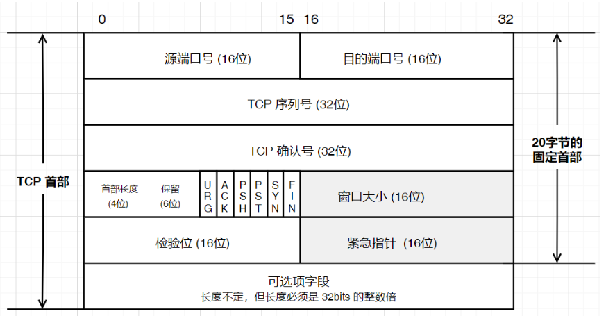
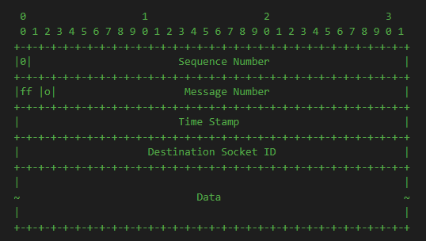
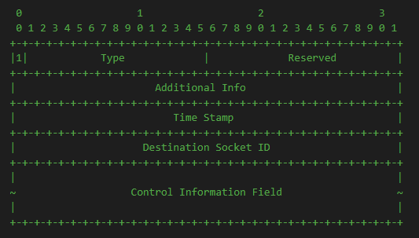

## 报文格式

### TCP

TCP是面向字节流的，为每一个字节编号。

上图中TCP报文中每个字段含义如下：

|    字段名    | 字段含义                                                     |
| :----------: | :----------------------------------------------------------- |
|   源端口号   | 源计算机上的应用程序的端口号。                               |
|  目的端口号  | 目的计算机上应用程序的端口号。                               |
|  TCP序列号   | 当SYN不为1时，表示本报文所发送数据的第一个字节的编号。当SYN为1时，代表初始序列值(ISN)，用于对序列号同步。 |
|  TCP确认号   | 表示接收方期望收到下一个报文段的首字节的编号。               |
| TCP 首部长度 | TCP数据段头部分的长度，告诉接收方的应用程序，数据从何处开始。由于可选项字段长度不固定，因此指定数据起始位置是有必要的。 |
|     保留     | 保留今后使用，目前应置为0。                                  |
|   紧急URG    | 当URG=1时，表明紧急指针字段有效。它告诉系统此报文段中有紧急数据，应尽快发送，而不要按原来的排队顺序来传送。 |
|   确认ACK    | 当ACK = 1时确认号字段才有效，当ACK = 0时确认号无效。         |
|   推送PSH    | 当PSH=1时接收方不用等到填满接收缓存再向上交付。可以立即向应用进程交付。当PSH=0时必须等待接收缓存填满才会向应用进程交付。 |
|   复位RST    | 当RST=1时，表名TCP连接中出现了严重错误（如由于主机崩溃或其他原因），必须释放连接，然后再重新建立传输连接。RST置为1还用来拒绝一个非法的报文段或拒绝打开一个连接。 |
|   同步SYN    | 在连接建立时用来同步序号。                                   |
|   终止FIN    | 用来释放一个连接。当FIN=1时，表明此报文段的发送发的数据已发送完毕，并要求释放运输连接。 |
|     窗口     | 窗口指的是发送本报文段的一方的接受窗口。代表从本报文段首部中的确认号算起，接收方目前允许对方发送的数据量。 |
|    校验和    | 它用于确认传输的数据是否有损坏。                             |
|   紧急指针   | 仅当前面的 URG 控制位为 1 时才有意义。它指出本数据段中为紧急数据的字节数，占 16 位；当所有紧急数据处理完后，TCP 就会告诉应用程序恢复到正常操作。即使当前窗口大小为 0，也是可以发送紧急数据的，因为紧急数据无须缓存。 |
|  可选项字段  | 长度可变，最长可达4字节。                                    |

### UDT

UDT是基于UDP的应用层可靠数据传输协议，以报文段为单位，为每个数据包编号。UDT报文分为两种，数据包与控制包。

#### 数据包

| 位置                   | 含义                                                         |
| ---------------------- | ------------------------------------------------------------ |
| 第1个字节的0个bit位    | 当为0时，代表数据包，当为1时，代表控制包。                   |
| 第1个字节的2~31个bit位 | 当前报文段携带的数据包序列号。                               |
| 第2个字节的0~1个bit位  | 当为10时，代表一个消息包的起始报文段，当为01时，代表一个消息包的末尾报文段。当为11时，代表该消息包的大小小于最大报文段，用一个报文就可以满足传输。 |
| 第2个字节的2个bit位    | 半可靠数据传输中使用，当为1时，代表必须交付；当为0时，代表不必须交付，丢了可能就不重传了。 |
| 第3个字节              | 时间戳，代表UDT实体创建以来的时间差。                        |
| 第4个字节              | 连接对方的socketID。虚拟socketID，因为底层是UDP，UDP无连接，所以需要一个socketID来确定本次消息发送给哪个udt socket实例。 |

#### 控制包

| 位置                 | 含义                                             |
| -------------------- | ------------------------------------------------ |
| 第1个字节的0个bit位  | 当为0时，代表数据包，当为1时，代表控制包。       |
| 第1个字节的1~15字节  | 控制包的类型，有七种类型。                       |
| 第1个字节的16~31字节 | 当Type为0x7FFF时，使用Reserved字段拓展控制包。   |
| 第2个字节            | 控制包中的附加信息。用于特殊处理。               |
| 第3个字节            | 时间戳，暂时没用到。                             |
| 第4个字节            | 连接对方的socketID。当新socket连接时，该字段为0. |

### KCP

KCP也是以报文段为单位，为每个报文段编号。

| 字段 | 含义                                                         |
| ---- | ------------------------------------------------------------ |
| Conv | conversation会话序号，服务器为当前连接分配的唯一ID，也是因为底层是UDP的原因，要定义唯一标识。 |
| Cmd  | command报文类型。有四种，RUDP_CMD_PUSH、RUDP_CMD_ACK、RUDP_CMD_WASK、RUDP_CMD_WINS。 |
| Frg  | fragment分段序号，报文在包中的位置：包被分割成n个报文进行发送，frg=n-index-1 [倒序索引] |
| Wnd  | window，接收窗口未被使用的大小：wnd=rcv_wnd - rcv_queue.Length |
| Ts   | timestamp，发送的时间戳                                      |
| Sn   | sequence number，Kcp包的序列号。                             |
| Una  | unacknowledged，当前待接收报文段的最小序列号。此编号之前的所有报文都已经被接受。 |
| Len  | 数据长度。                                                   |
| Data | 实际传输的用户数据，默认的Mtu为1400Byte。                    |

## 术语定义

为了接下来能够轻松的描述清楚，在这里先定义相关术语。

- 发送端：主机A
- 接收端：主机B

## 确认应答

确认应答是可靠传输的核心机制。分析一下TCP、UDT、KCP三种协议的实现方式。

### TCP

TCP是面向字节流的，为每一个字节编号。应答报文本质上是ACK字段为1的报文，此时报文头部中的**确认序号**才是生效的。告诉对方下一个需要发送的序列号。

### UDT

UDT是对UDP封装的应用层协议，以数据报为单位，UDT为每个报文段编号。当UDT接收到数据报文段时，将以控制包的方式向发送发通知ACK。

### KCP

KCP也是以数据报为单位，为每个报文段编号。当KCP接收到报文段，将以`Cmd=RUDP_CMD_ACK`的数据包进行应答。

## 超时重传

确认应答是理论情况下，数据在传输过程中有可能丢失。超时重传就至关重要啦。

超时重传机制的核心是一个计时器，当发送一条数据之后，启动计时器，经过一个RTT没有收到ACK应答，会重新发送数据。有两种状态可能导致收不到ACK确认应答。

1. 发送过程中，数据丢失，未到达*主机B*。
2. 数据到达*主机B*，返回的确认ACK丢失，*主机A*迟迟收不到ACK确认应答。

不管是TCP、UDT还是KCP，它们的实现方式相同。他们的RTT计算方式可能存在差异，我们将在RTT中介绍。

## 连接管理

TCP和UDT实现了连接管理，KCP本身没有实现连接管理，用户需自行封装。

### TCP

#### 三次握手

#### 四次挥手

### UDT

#### 四次握手

#### 挥手过程

UDT的挥手过程有点暴力，直接close后关闭双向通道。不考虑对方是否发送完成。对方的关闭是通过超时连接后关闭。

## 滑动窗口

在可靠性的前提下，进一步提高信道的利用率，提升传输效率。

使用滑动窗口使*主机A*可以一次性发送N个报文段，使N份报文段的发送时间压缩到一份时间内，提高传输效率。可以在以下两个情况考虑：

1. 丢包的是ACK，不需要进行任何额外的处理。
2. 丢包的是数据包，主机B收到数据包的序列号大于丢包序列号时，返回丢失包的序列号ACK，主机A收到ACK，重新发送丢失的数据包，其他的数据包不需要额外重传。

从以上的两个情况中，我们可以看到快速重传的影子，当多次收到相同序列号的ACK时，开启快速重传，不需要等到定时器超时。

阅读UDT、KCP源码发现，它们的实现方案如TCP一样。

## 流量控制

窗口大小不能无限大，传输速率太快，接收方可能处理不过来。应该根据接收方接收处理数据能力反向制衡发送方的发送速率。

在TCP、UDT和KCP中分别有这样的功能，在TCP中通过**窗口大小**字段同步接收窗口大小，在UDT中通过ACK确认应答来同步接收窗口。在KCP中通过wnd字段同步接收窗口大小。

## 拥塞控制

## RTO

### TCP

2倍

### UDT

### KCP

1.5倍

## 延迟ACK

### TCP

延迟ack

### UDT

### KCP

可调节的延迟ack

## 重传策略

### TCP

全部重传

### UDT

选择性重传

### KCP

选择性重传

## 停止等待协议ARQ

### TCP

此编号前所有包已收到  UNA

### UDT

### KCP

UNA+ACK

## 报文段的首部格式

### TCP

### UDT

### KCP

## 发送窗口构造

### TCP

### UDT

### KCP

## 缓存和窗口

### TCP

### UDT

### KCP

## Nagle 算法

### TCP

### UDT

### KCP

## 拥塞控制

### TCP

#### 慢开始

#### 拥塞避免

#### 快重传

#### 快恢复

### UDT

#### 慢开始

#### 拥塞避免

#### 快重传

#### 快恢复

### KCP

#### 慢开始

#### 拥塞避免

#### 快重传

#### 快恢复

### 

